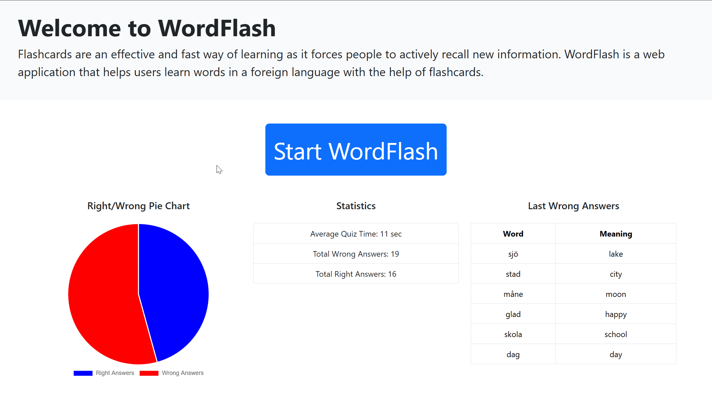

Flashcards are an effective and fast way of learning as it forces people to actively recall new information. "WordFlash" is a web application that helps users learn words in a foreign language with the help of flashcards.

