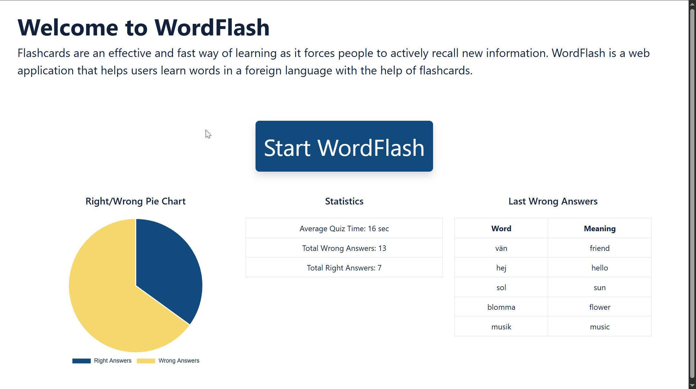

# WordFlash
Flashcards are an effective and fast way of learning as it forces people to actively recall new information. "WordFlash" is a web application that helps users learn words in a foreign language with the help of flashcards.

## Video

## Demo

## Project Structure
- For each page there is an html page. For example: index.html, wordflash.html
- For each html page there is a corresponding JavaScript file. For example: index.js, wordflash.js
- Css styles are located in styes.css.
- Shared JavaScript functions are located in shared.js.
- The folder `dictionaries` contains a database of words for different languages. Currently the application supports only one language - Swedish

## Local Development
For local development you can install Visual Studio Code and run the project locally with Live Server extension.

## Libraries
- [Bootstrap 5.3](https://getbootstrap.com/)
- [Chart.js](https://www.chartjs.org/)

## Project Board
[https://github.com/users/svetlozara-godzheva/projects/3](https://github.com/users/svetlozara-godzheva/projects/3)